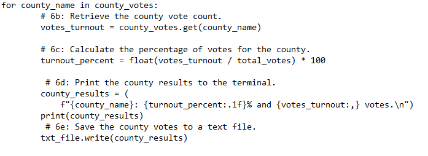
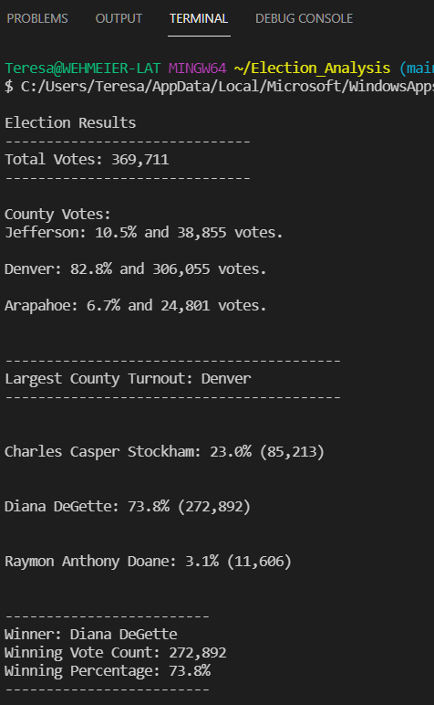

# Election Audit Analysis

## Project Overview
A Colorado election commission requests an election audit and analysis of a local congressional election. The expected results should include:
- Total votes
- Total county votes and percentage by county
- County with the highest voter turnout
- Candidate votes and percentage of total votes
- Winner of the election with total and percentage of votes

### Resources
- Data source: election_results.csv
- Software: Python 3.9.7; Visual Studio Code 1.6.22

### Election-Audit Results:
The project requirements utilize Python programming that reads the election data set, compiles the requested information, and prints the results to a text file and a terminal screen. 

1. Total votes cast in the congressional election
  - There were 369,711 total votes cast in the congressional election. the Python script used to obtain these results is shown in this image; the results are presented in the text file and on the terminal:
  
     
     
2. Breakdown of the number of votes and percentage of total votes for each county in the precint.
  - Three counties had voter returns in the data file provided; they were Jefferson, Denver and Arapahoe. Of the 369,711 votes cast, 10.5% (38,855) were from Jefferson; 82.8% (306,055) were from Denver; and 6.7% (24,801) were from Arapahoe. The portion of Python code used to derive these results is provided in the image below.

  

4. The total number of votes and percentage each candidate received.
  - There were three candidates in the election audit. The results by candidate are provided as they appear in the text file and on the terminal screen.
    - Charles Casper Stockham received 23.0%, or 85,213 votes
    - Diana DeGette received 73.8%, or 272,892 votes
    - Raymon Anthony Doane received 3.1%, or 11,606 votes

5. Identify the winner of the election, their vote count and percentage of total votes.
  - The winner of the election audit was Diana DeGette, with 73.8% (272,892) of the vote. In the image below, the image below is provided to show how the results were derived:

  

### Text File Results
An image of the text file is provided to demonstrate the requested output results to a text file.
 
  
 
 ### Terminal Results
 An image of the terminal print results is provided to show the requested output results to the terminal.
 
 
 
### Election-Audit Summary
The provided Python coded audit application is robust and can be used on a much wider scale. The data provided for this audit includes three counties in the state, but the audit program can accomodate much larger data sets, and could be expanded to all counties in Colorado.

The election commission may wish to consider some additional functionality to the Python script used to develop this audit. For example, it might be interesting to discover the winning candidate by county. By simply adding an additional "if" statement to the current code, the number of candidates per county could be tallied, providing deeper insight into the voting patterns within a given county. It would also be interesting to find voter turnout by polling location. A polling location column would need to be added to the election_results_csv file, but the ability to drill deeply into polling locations would provide information on voter volume, and may assist in planning future voting locations based on the analysis. For example, the analysis may reveal that some polling locations are under utilized, while others have more voter participation than staff can manage, which would allow a more data-driven polling plan during future elections.

